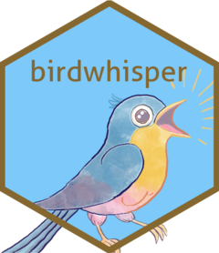

<!-- README.md is generated from README.Rmd. Please edit that file -->

# birdwhisper 

<!-- badges: start -->

[](https://lifecycle.r-lib.org/articles/stages.html#experimental)
[](https://github.com/samherniman/birdwhisper/actions/workflows/R-CMD-check.yaml)
<!-- badges: end -->

## Test your knowledge of bird songs in any region

Birdwhisper searches community science databases for lists of birds in a
given region. It then makes it easy to download bird calls from that
area and test yourself in identifying the species.

## Installation

You can install the development version of birdwhisper from
[GitHub](https://github.com/) with:

``` r
# install.packages("pak")
pak::pak("samherniman/birdwhisper")
```

## Example

Turn on the package with:

``` r
library(birdwhisper)
```

Make a list of bird species by supplying a location. The location can be
the name of the place, like `"Vancouver, BC"` or an {sf} object

``` r
spp_lst <- collect_species_list("Vancouver, BC")
#> Passing 1 address to the Nominatim single address geocoder
#> Query completed in: 1 seconds

head(spp_lst)
#> [1] "Turdus migratorius"    "Lophodytes cucullatus" "Phalacrocorax auritus"
#> [4] "Colaptes auratus"      "Branta canadensis"     "Junco hyemalis"
```

Use `search_xeno_canto()` to find recordings in Xeno Canto of each
species in your species list. Then you can use `download_recordings()`
to download a selection of them to your computer.

``` r
resps <- search_xeno_canto(spp_lst)
recs <- download_recordings(resps, save_directory = here::here())
```

`test_me()` will play each recording randomly and ask you to name the
species you hear. Hopefully you will get better at naming each one over
time.

``` r
test_me(recs)
```

At the moment, the tests are more like flashcards, where it just tells
you the answer when you’re ready. Later, I’d like to add multiple choice
tests and true/false tests.

I hope this package encourages people to get outside!

## Code of Conduct

Please note that the birdwhisper project is released with a [Contributor
Code of
Conduct](https://contributor-covenant.org/version/2/1/CODE_OF_CONDUCT.html).
By contributing to this project, you agree to abide by its terms.
